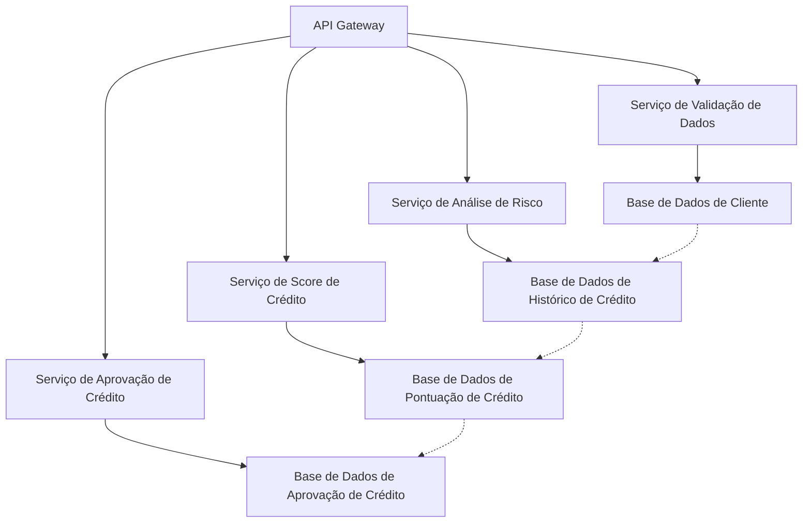

# O que são Microserviços?

Microserviços são uma abordagem arquitetural onde uma aplicação é construída como um conjunto de serviços pequenos e independentes. Cada serviço é responsável por uma função específica do sistema e pode ser desenvolvido, testado, implantado e escalado de forma independente.

Cada microserviço geralmente:

- Tem sua própria base de dados
- Comunica-se com outros microserviços via APIs
- É focado em uma única tarefa ou funcionalidade

A principal vantagem dessa arquitetura é a escalabilidade e flexibilidade, permitindo que diferentes partes do sistema sejam atualizadas sem impactar o sistema como um todo.

## Vantagens dos Microserviços

- **Escalabilidade**: Você pode escalar partes específicas do sistema conforme a demanda, sem precisar escalar a aplicação inteira
- **Independência de Deploy**: Cada microserviço pode ser atualizado e implantado independentemente
- **Resiliência**: Se um microserviço falhar, os outros podem continuar funcionando normalmente
- **Flexibilidade tecnológica**: Diferentes microserviços podem ser escritos em diferentes linguagens de programação, dependendo da necessidade

## Exemplo de Demanda Simples para Microserviço

Vamos criar um sistema simples de **Análise de Crédito** utilizando microserviços.

Imaginemos que temos um serviço de análise de crédito que depende de diferentes processos:

1. **Serviço de Validação de Dados Pessoais**: Verifica se os dados do cliente estão corretos e completos
2. **Serviço de Análise de Risco**: Calcula o risco de crédito do cliente com base no histórico financeiro
3. **Serviço de Score de Crédito**: Retorna o score de crédito do cliente a partir de uma pontuação calculada
4. **Serviço de Aprovação de Crédito**: Baseado nas informações anteriores, decide se o crédito pode ser aprovado

## Diagrama de Arquitetura de Microserviço

### Explicação do Diagrama

**API Gateway**: Serve como ponto de entrada para o sistema, encaminhando as solicitações para os microserviços apropriados.

**Serviços de Microserviços**:
- **Validação de Dados**: Responsável por garantir que os dados fornecidos pelo cliente sejam válidos
- **Análise de Risco**: Avalia o risco de conceder crédito ao cliente com base em seu histórico financeiro
- **Score de Crédito**: Calcula o score de crédito com base nas informações financeiras do cliente
- **Aprovação de Crédito**: Decisões finais sobre a aprovação do crédito

**Bases de Dados Independentes**: Cada microserviço tem seu próprio banco de dados, o que garante a independência e escalabilidade.
